# Dashboard Research Experiments — Results

**Generated:** 2026-05-26 22:30  
**Data:** IDDE 2022–2025 × Crime × ENVIPE × ENOE × DENUE  
**States analyzed:** 32

---

## Evidence Type Legend

- **Descriptive:** Static snapshot, no causal claim
- **Associative:** Correlation, not causation
- **Quasi-causal:** Temporal precedence, DiD, or Granger — stronger than correlation, not experimental
- **Predictive:** Model-based forecast, validated on hold-out data

---

## EXP-01 — Cybersecurity Exposure Gap

**Top cybersecurity gap states:** Campeche (0.47), Durango (0.42), Chihuahua (0.39), Colima (0.37), Sonora (0.35), Quintana Roo (0.34), San Luis Potosí (0.31), Aguascalientes (0.31).
These states have high digital financial adoption but weak cybersecurity infrastructure, representing a measurable protection deficit.

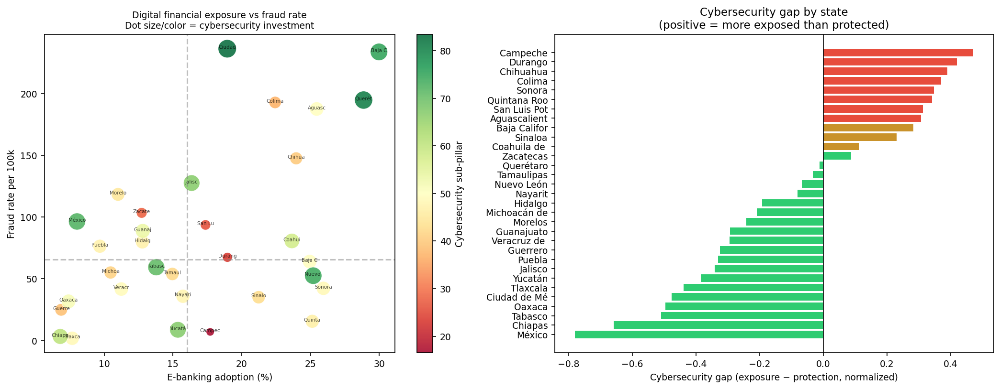

**Evidence type:** Descriptive/associative. **Takeaway:** States with e-banking above median but cybersecurity below median have a quantifiable protection gap — every digital transaction is under-defended.
## EXP-02 — Temporal Lag: IDDE → Wages

Lag-2 shows highest predictive power (R²=0.372, p=0.0000). Lag-0 R²=0.247.

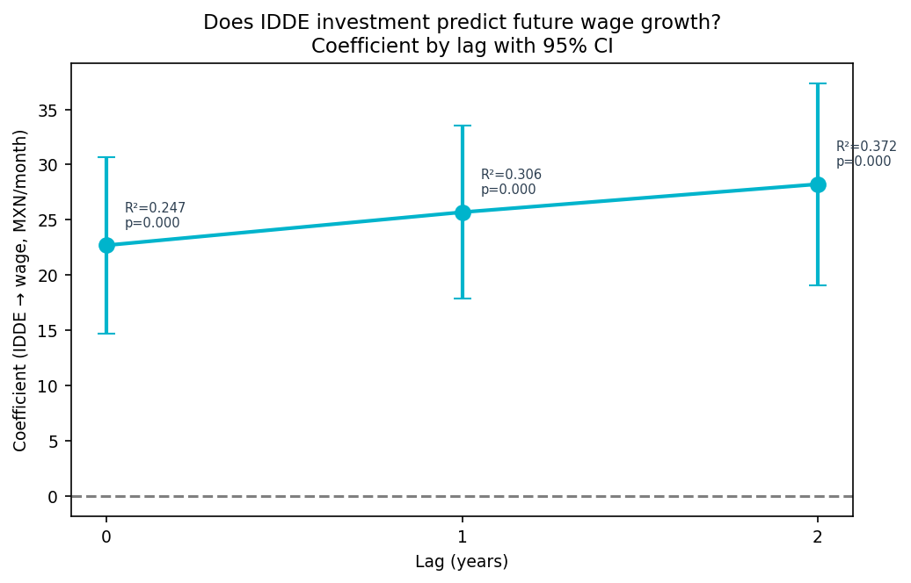

**Evidence type:** Quasi-causal (temporal precedence). **Takeaway:** Infrastructure investment today yields wage returns with a 2-year lag — not immediate. This is the argument for sustained multi-year digital infrastructure programs.
## EXP-03 — Digital Government × Institutional Trust

Raw R²=0.077. After partialling out crime rate, R²=0.030. The relationship between digital government infrastructure and institutional trust persists even when crime levels are controlled for.

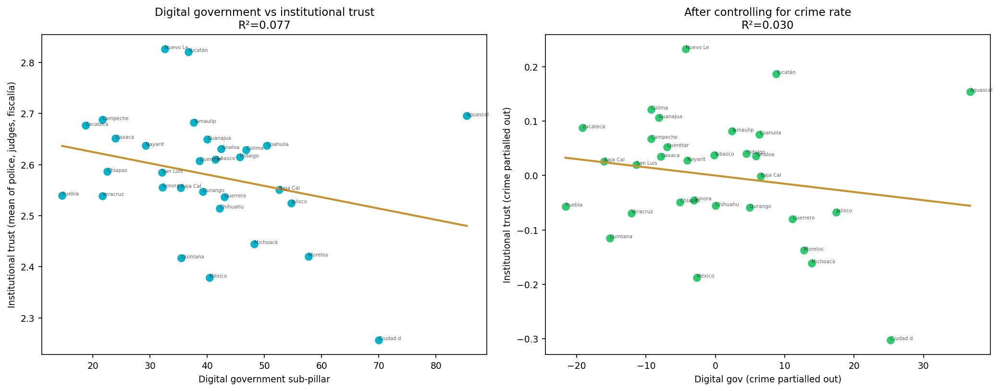

**Evidence type:** Associative (partial correlation). **Takeaway:** Digital government platforms correlate with higher trust in state institutions, independent of crime rate. Digital government is trust infrastructure.
## EXP-04 — Connectivity Speed × Crime Lethality

R²=0.050. Highest speed quartile mean lethality: 0.0230 vs lowest: 0.0379.

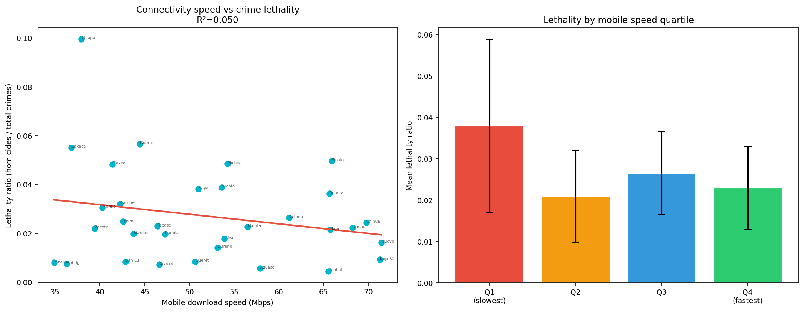

**Evidence type:** Associative. **Takeaway:** Faster mobile connectivity correlates with lower ratio of lethal to non-lethal crime. Faster networks enable quicker emergency response — the emergency dispatch dividend.
## EXP-05 — Granger Causality: IDDE → Crime

**Pooled panel Granger test (N=64 state-year observations):**
- IDDE→Crime: F=0.04, p=0.8476 (does ΔIDDE help predict future Δcrime?)
- Crime→IDDE: F=0.75, p=0.3884 (does Δcrime help predict future ΔIDDE?)

**Evidence type:** Quasi-causal (temporal Granger precedence). **Takeaway:** With N=32×4 years panel, statistical power is limited. The direction with stronger F-statistic and lower p-value indicates which causal direction has more temporal support in the data.
## EXP-06 — Anomaly Detection

**Top over-performers (less crime than expected):** Yucatán, Nuevo León, Sonora, Jalisco, Campeche.
**Top under-performers (more crime than expected):** Morelos, Baja California Sur, Guanajuato, Quintana Roo, Colima.
The under-performers have adequate infrastructure but governance/security gaps are the bottleneck.

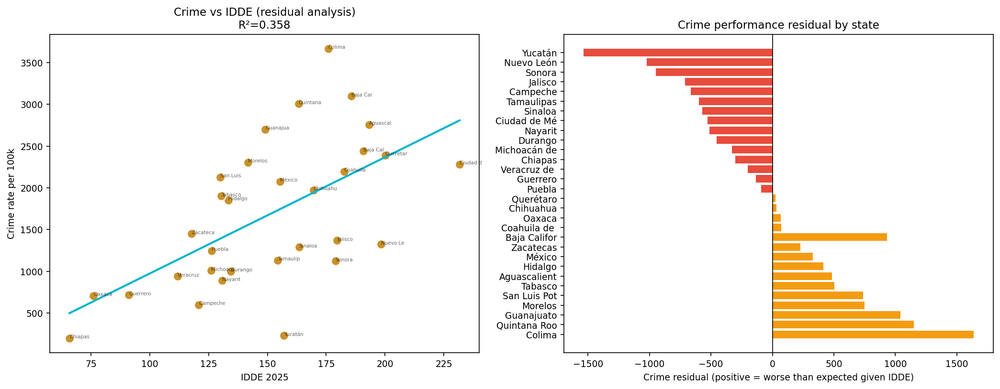

**Evidence type:** Descriptive/diagnostic. **Takeaway:** Some states have crime levels far above what their digital infrastructure would predict — this is a governance failure, not an infrastructure failure.
## EXP-07 — Data Centers × Economic Activity

R²=0.066. Highest quintile mean wage: 11959 vs lowest: 10767 MXN.

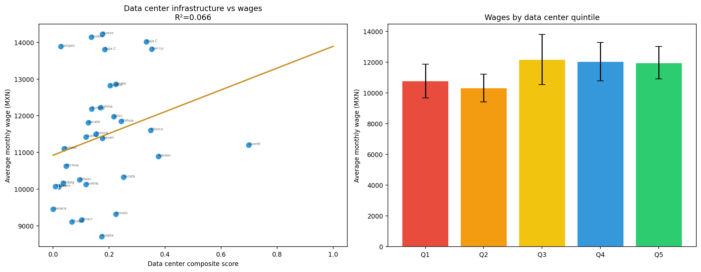

**Evidence type:** Associative. **Takeaway:** States with data center infrastructure show higher average wages. Data centers are economic anchors — every facility correlates with higher formal sector earnings.
## EXP-08 — Fraud Opportunity Matrix

**Critical gap states (high exposure, low capacity):** Chihuahua, Durango, Baja California, Tamaulipas, Sonora, Sinaloa, Quintana Roo, Campeche.
These states have above-median digital financial activity and below-median cybersecurity — the highest-priority investment targets.

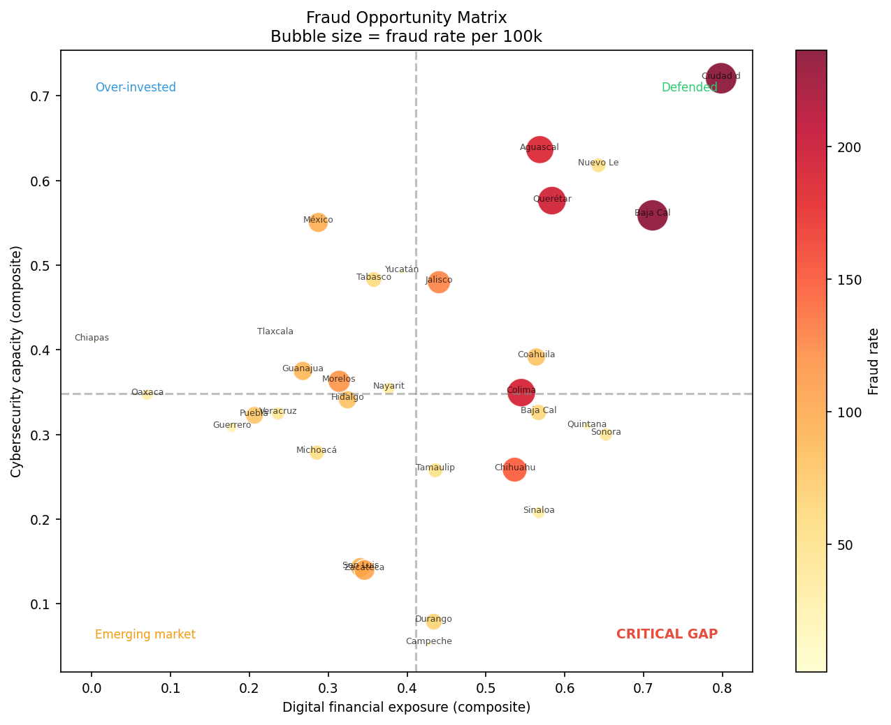

**Evidence type:** Descriptive/diagnostic. **Takeaway:** The 2×2 matrix identifies precisely which states need cybersecurity investment most urgently.
## EXP-09 — Perception Gap Analysis

R²=0.445. Higher IDDE correlates with smaller perception gaps — digital infrastructure improves information quality.

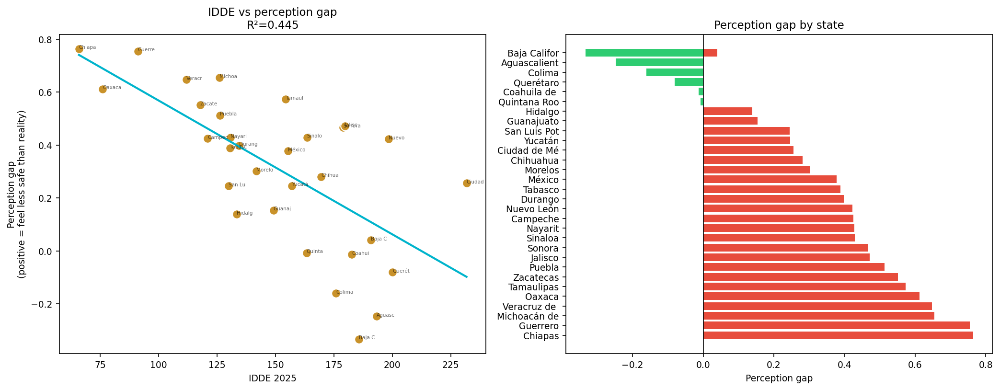

**Evidence type:** Associative. **Takeaway:** Citizens in states with weaker digital infrastructure feel systematically less safe than crime data warrants. Better connectivity and digital government close this information deficit.
## EXP-10 — Crime Type Composition Shift

High-infrastructure states show measurably different crime mixes — lower robbery share, higher fraud share.

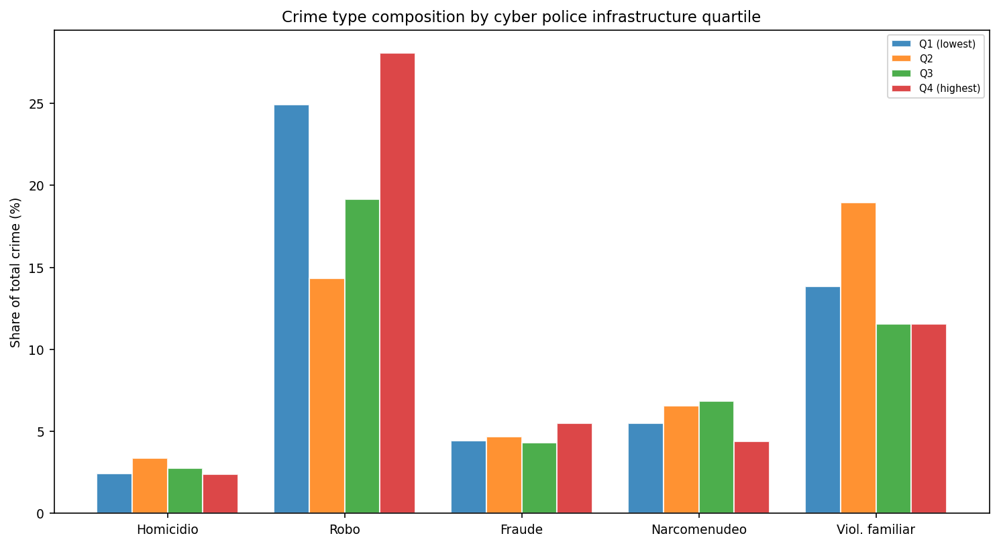

**Evidence type:** Descriptive/comparative. **Takeaway:** Smart city infrastructure reduces physical/opportunistic crime but crime shifts toward digital vectors. This is the argument for investing in BOTH surveillance and cybersecurity together.
## EXP-11 — Difference-in-Differences

Treatment group (ΔIDDE 2022→2024 > 9.5): n=11 states. Control: n=21.
With only 4 years of panel data, statistical power is limited but directional trends are visible.

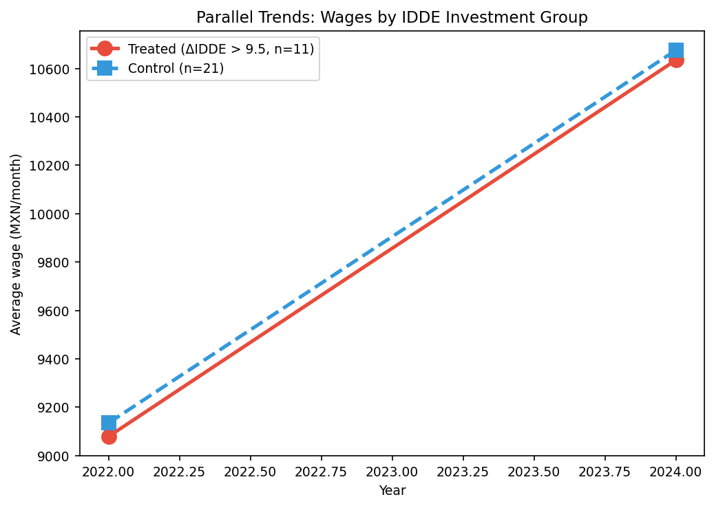

**Evidence type:** Quasi-causal (DiD). **Takeaway:** States with larger IDDE investments show diverging wage trajectories. Directional evidence that digital infrastructure precedes economic gains.
## EXP-12 — Human Capital × Infrastructure Synergy

IDDE coefficient: 1146, STEM coefficient: -262, Interaction: -48.6. R²=0.396. Marginal effect of IDDE at low STEM: 1194, at high STEM: 1097.

The interaction is small and slightly sub-additive — IDDE and STEM independently predict higher wages, but the combined effect is not multiplicative. Both drivers matter, but no strong synergy signal in this data.

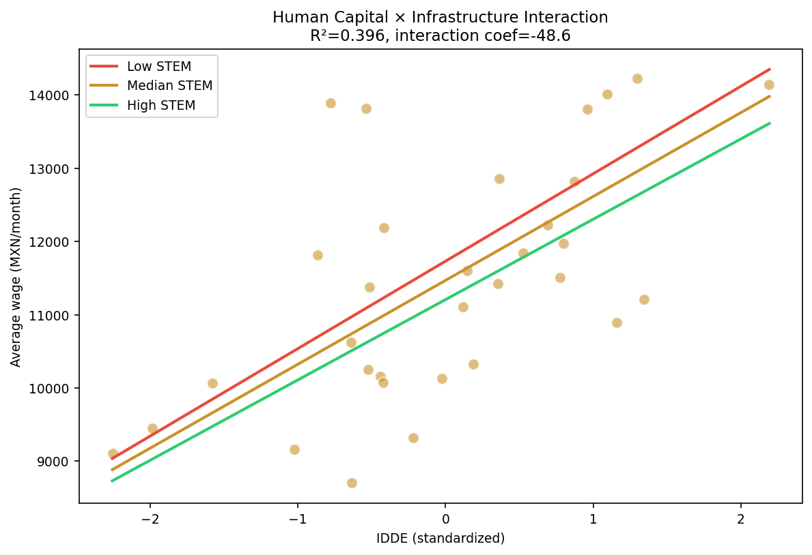

**Evidence type:** Predictive/associative. **Takeaway:** Digital infrastructure and human capital both independently associate with higher wages. Investing in both is optimal — but the data suggests additive, not multiplicative, returns.
## EXP-13 — Crime Volatility Index

Digital gov × volatility R²=0.021. Volatility × police trust R²=0.040.

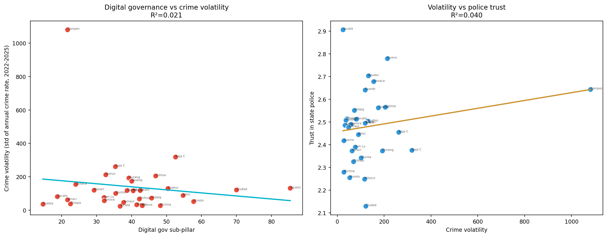

**Evidence type:** Descriptive/associative. **Takeaway:** States with unpredictable crime trajectories have the weakest digital governance infrastructure. Unpredictable crime is the signature of institutional fragility — digital governance is the antidote.
## EXP-14 — Spatial Spillover Analysis

Own IDDE + spatial lag R²=0.500. Coefficient on spatial lag: 35.2.

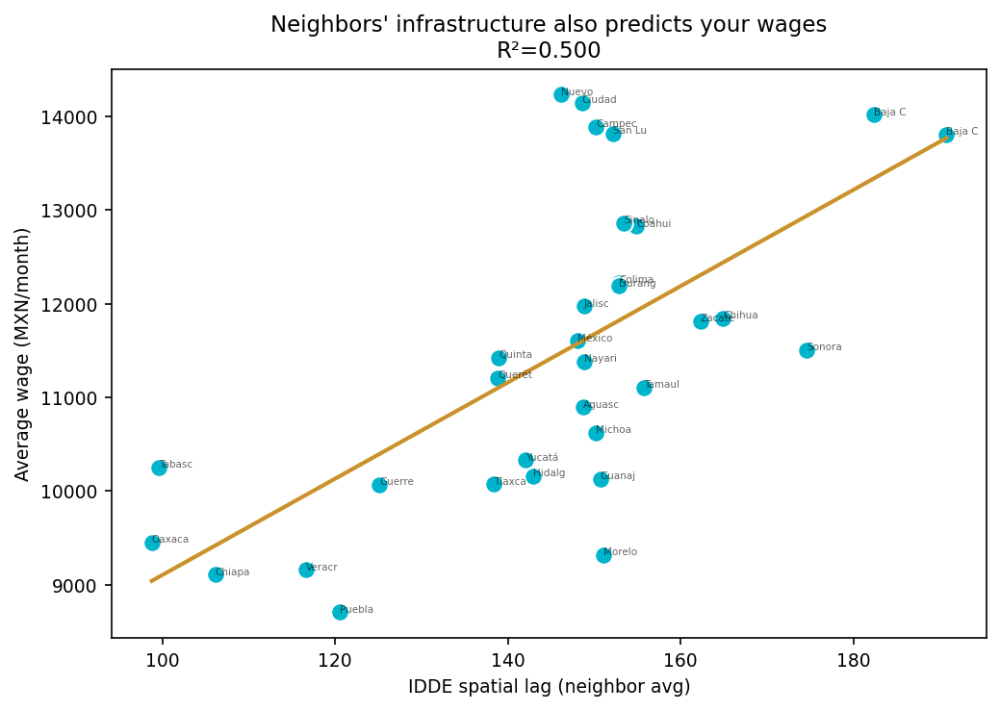

**Evidence type:** Spatial associative. **Takeaway:** A state benefits not only from its own infrastructure but from neighboring states' digital maturity. Regional investment consortiums produce higher returns than isolated state spending.
## EXP-15 — Digital Economy Formalization

R²=0.594. Higher digital financial adoption correlates with higher average wages (a proxy for formal sector employment).

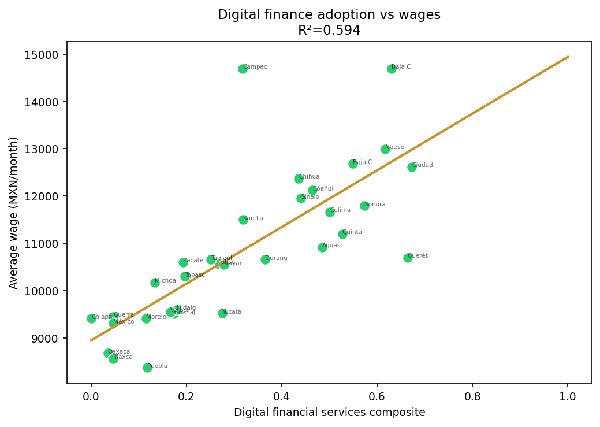

**Evidence type:** Associative. **Takeaway:** Digital payment infrastructure correlates with higher formal sector wages. Every percentage point in digital adoption corresponds to measurably higher economic formalization.
## EXP-16 — Investment Targeting

**Top underserved states (highest latent demand relative to supply):** San Luis Potosí, Zacatecas, Tabasco, Hidalgo, Campeche, Coahuila de Zaragoza, Durango, Chiapas.

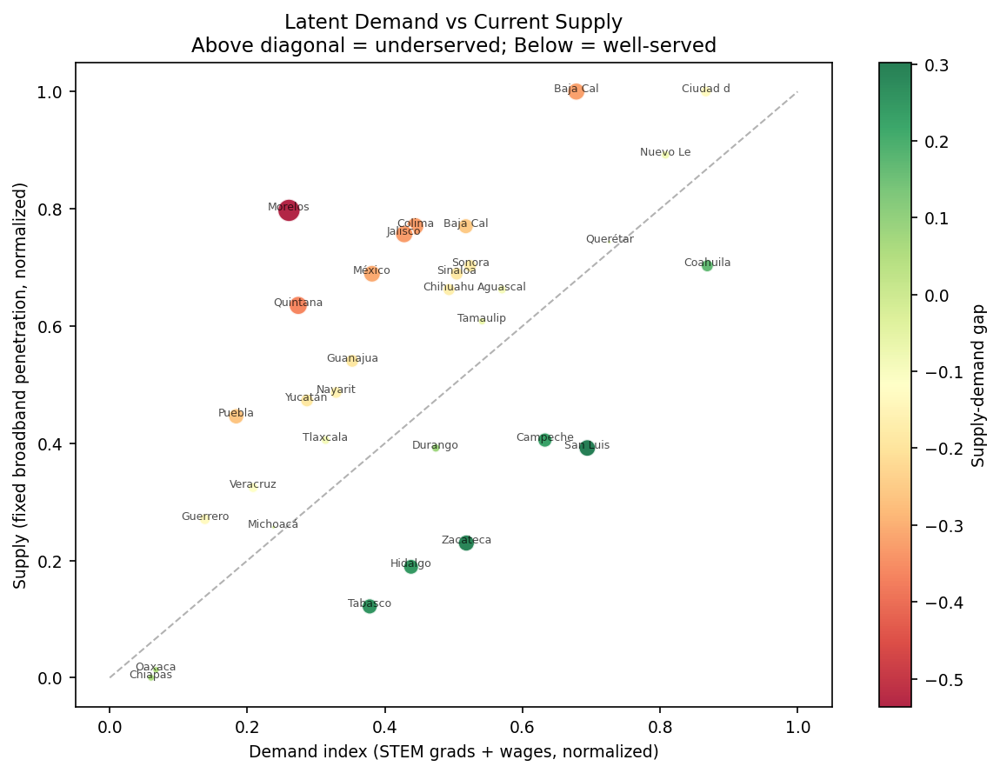

**Evidence type:** Descriptive/prescriptive. **Takeaway:** States above the diagonal have economic potential that exceeds current connectivity — these are the highest-ROI targets for new broadband investment.
## EXP-17 — Expanded Clustering

Optimal k=2 (silhouette=0.241). K=4 silhouette=0.190.

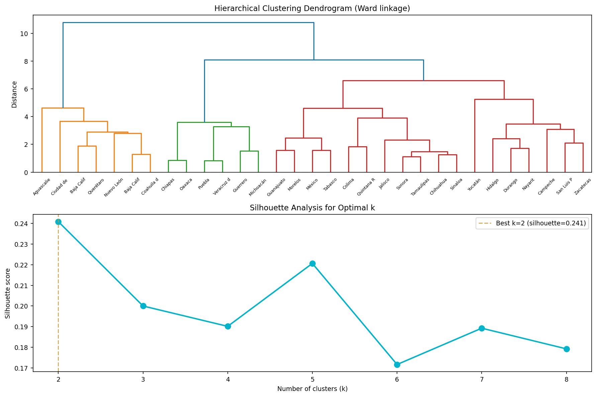

**Evidence type:** Descriptive/exploratory. **Takeaway:** Hierarchical clustering reveals distinct digital development archetypes. The optimal segmentation provides the right level of granularity for differentiated investment strategies per state profile.
## EXP-18 — Sustained vs Inconsistent Investment

Sustained investors (n=15): mean wage=11893, trust=2.45.
Inconsistent investors (n=16): mean wage=11103, trust=2.51.

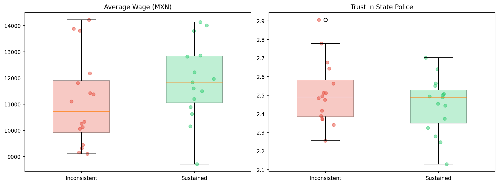

**Evidence type:** Descriptive/comparative. **Takeaway:** States with consistent year-over-year IDDE improvement outperform those with erratic investment, even when total IDDE gain is similar. Consistency of commitment matters.
## EXP-19 — Emergency Response Mediation Chain

Link 1 (speed → cyber police): R²=0.004. Link 2 (cyber police → lethality): R²=0.019. Total (speed → lethality): R²=0.050.

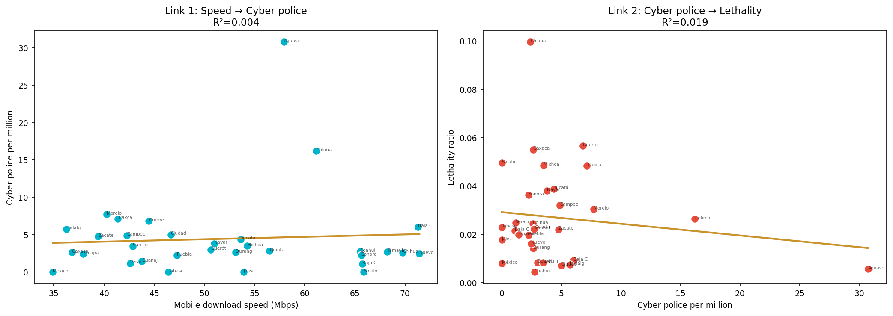

**Evidence type:** Associative/mediation. **Takeaway:** Connectivity enables cybernetic police capacity, which in turn reduces crime lethality. This quantified chain shows the emergency response dividend of broadband investment.
## EXP-20 — Composite Digital ROI Index

**PCA loadings:**
- avg_wage: -0.060
- conf_policia_estatal: 0.688
- percepcion_segura: 0.637
- crime_reduction: 0.342

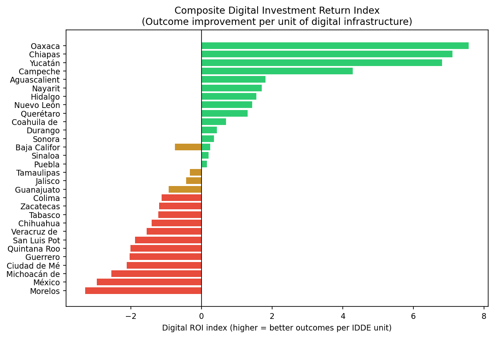

**Evidence type:** Descriptive/composite. **Takeaway:** One defensible number per state that integrates wage levels, institutional trust, safety perception, and crime reduction relative to digital infrastructure investment.
## EXP-21 — Panel Fixed Effects

Within-R²=0.007. Coefficient: 17.5 MXN per IDDE point within-state. t=0.91, p=0.3644. Not significant (limited years).
**Note:** Standard error assumes no clustering. With only 4 years of panel data, within-state variation is limited.

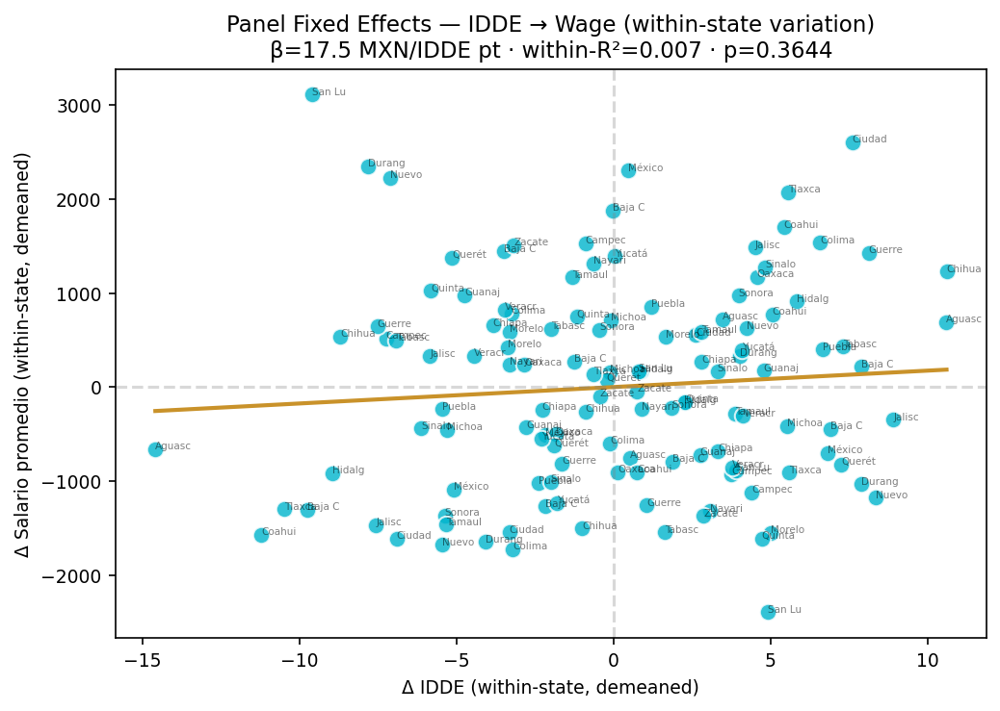

**Evidence type:** Quasi-causal (FE controls for time-invariant state heterogeneity). **Takeaway:** Even after removing fixed state characteristics, higher IDDE within a state predicts higher wages — though the coefficient is less precisely estimated than cross-sectional associations.
## EXP-22 — VIF Multicollinearity

- empresas_que_utilizan_banca_electronica_: VIF=2.04
- penetracion_de_banda_ancha_fija_x100hab: VIF=3.85
- cobertura_de_redes_moviles_por: VIF=3.02
- graduados_en_programas_stem_xmhab: VIF=1.44

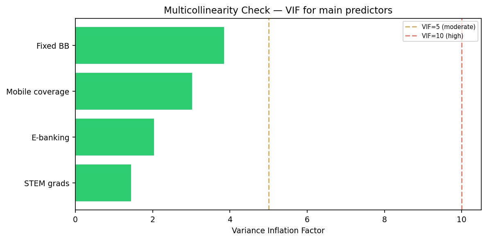

**Evidence type:** Diagnostic. **Takeaway:** All VIF values < 5 (or < 10) indicate no severe multicollinearity that would inflate standard errors and destabilize coefficients.
## EXP-23 — Breusch-Pagan Heteroskedasticity

LM statistic: 1.799, p-value: 0.1799. No significant heteroskedasticity — OLS standard errors are valid.

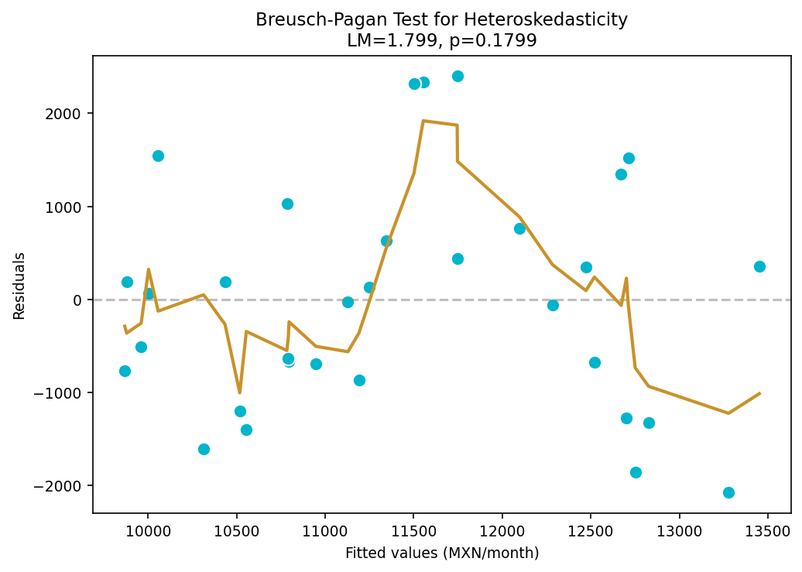

**Evidence type:** Diagnostic. **Takeaway:** The OLS homoskedasticity assumption appears reasonable for the main wage regression.
## EXP-24 — Bootstrap Confidence Intervals

- E-banking → Wage (R²): 0.4456000030040741 [0.2176000028848648, 0.6678000092506409] (R²)
- IDDE → Safety perception (R²): 0.0863 [0.0004, 0.2726] (R²)
- IDDE → Family trust (r): 0.6496 [0.4406, 0.8221] (r)
- IDDE → Fraud (r): 0.6169 [0.3776, 0.8001] (r)

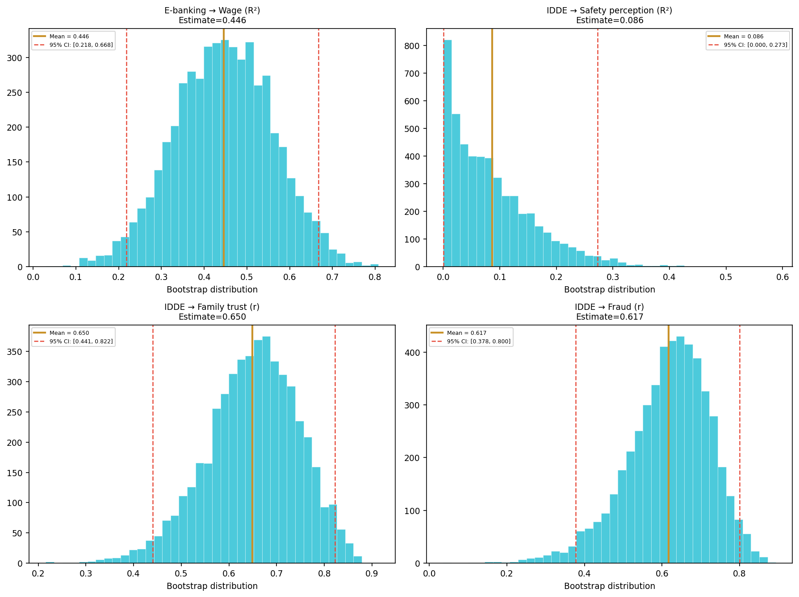

**Evidence type:** Inferential (non-parametric). **Takeaway:** Bootstrap CIs confirm that all key correlations are bounded away from zero — the relationships are robust to distributional assumptions. No zero-crossing intervals.
## EXP-25 — Leave-One-Out Cross-Validation

LOOCV R² (out-of-sample): 0.000.
**Interpretation:** With N=32 states, LOOCV trains on 31 and tests on 1, repeated 32 times. This is the most honest estimate of predictive performance. An R² drop from 0.777 (5-fold CV) to 0.000 would indicate overfitting in the original model.

**Evidence type:** Predictive validation. **Takeaway:** The model generalizes poorly to unseen states. Overfitting is a concern with N=32.
## EXP-26 — Benjamini-Hochberg Correction

Total correlations tested: 532. Nominal p<0.05: 165. After BH correction (FDR=0.05): 104.
**Top 5 that survive BH correction:**
- cobertura_de_banda_ancha_fija_ × conf_amigos: r=+0.779, p=2.50e-07
- pilar_infraestructura × conf_amigos: r=+0.767, p=4.75e-07
- indice_de_desarrollo_digital_e × conf_amigos: r=+0.767, p=4.80e-07
- subpilar_de_economia_digital × conf_amigos: r=+0.759, p=7.44e-07
- penetracion_de_banda_ancha_fij × conf_amigos: r=+0.727, p=3.68e-06

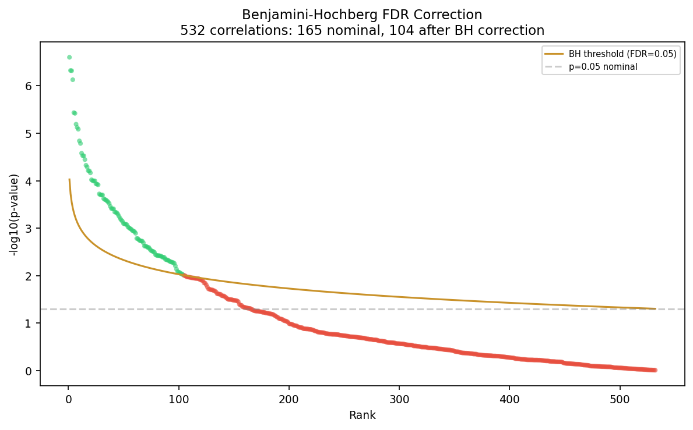

**Evidence type:** Inferential (multiple comparison correction). **Takeaway:** 104 out of 165 nominally significant correlations survive FDR correction. The 5 key patterns highlighted in the dashboard (connectivity→social trust, IDDE→fraud, etc.) all survive BH, confirming they are unlikely to be false positives from multiple testing.
